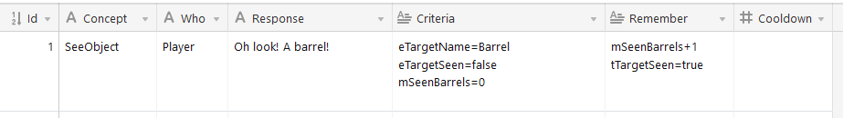

# Dialogue

An in-progress pattern-matching approach to dialogue events, based on the theory behind Valve's 2012 GDC talk: 
[AI-driven Dynamic Dialog through Fuzzy Pattern Matching](https://youtu.be/tAbBID3N64A)

Dialogue is stored as a series of rules, ordered from the specific to the general. Each rule tests state about 
triggering events, relevant characters or the state of the world. It is intended to be writable by a non-programmer.

When a rule is successful, the related dialogue is printed out and the rule can write back arbitrary data to 
relevant state sources. In this way, writers can create story-specific data for tracking thing like running jokes, 
sequential lines or properties about the world (without needing a programmer).

These dialogue rules, broken up as state-checking `Criteria` and state-writing `Rememberers`, are written out in 
Excel/Google Sheets/etc and exported as a CSV, for bringing into Unity. 

## State

The information accessible to a rule and its criteria/rememberers is broken up into 4 categories. Note that 'State'
cannot be written to, whereas 'Memory' is read-write.

### Event State

The triggering event (say, looking at an object) can bundle whatever additional state it wants as part of the call.
The project currently includes a "SeeObject" event, which includes information about the object looked at.

### Character State

The character responsible for the triggering event provides information about its own state, such as position, orientation,
name, etc.

### Character Memory

Any instance/object can have arbitrary state assigned to it. GameObjects that don't implement `IMemoryRetainer` have a
`MemoryContainer` component attached dynamically. This state can be whatever the writer wishes, and is useful to allow
a character to remember what it has said, seen, and done.

### World Memory
The global equivalent of character memory. This enables many actors to coordinate; for example, multiple characters
searching for objects could collectively know how many had been found.

## Example Rule

Here we see a rule which remarks upon and remembers the first barrel we look at.

### Id
An id unique to this rule. It can be checked by rules to ensure lines are correctly ordered.

### Concept / Who
**Concept** refers to the type of event, this case, looking at an object.
**Who** is the name of the speaking character.

These are both kept separate for optimization purposes.

### Criteria/Rememberer Formatting

When writing a criteria/rememberer, the checks are appended with a character associated with each of the state sources:
- **'e'**: Event State
- **'c'**: Character State
- **'m'**: Character Memory
- **'w'**: World Memeory
- **'t'**: Shortcut for accessing the memory of a 'target' character, if there is one.

Criteria can use the following basic operators to check state: '=', '>', '<', '!'.

Rememberers can set or mutate state with the following operators: '=', '-', '+', '*', '/'.

There are some reserved strings, such as 'true' and 'false'. These are explained in `RuleInterpreter.cs.`

### Cooldown
An optional parameter which allows a rule to re-trigger after x seconds. If no value is given, the rule is a one-shot and will never trigger twice.

# To-Do

- The `floatComparisons` branch represents an attempt to simplify all criteria to comparisons on a number-line. The Valve talk goes over this 
as [Optimization #6.](https://www.gdcvault.com/play/1015317/AI-driven-Dynamic-Dialog-through)

- Responses are currently just text. In the future they should be able to trigger animations, sound effects, and so on.

# Other

This project also includes a simple subtitle system used for displaying the dialogue. It tries to display subtitles matching to the [BBC Subtitling Guidelines,](https://bbc.github.io/subtitle-guidelines/) but is otherwise nothing special.
